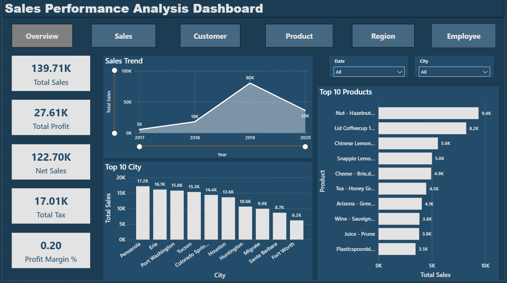
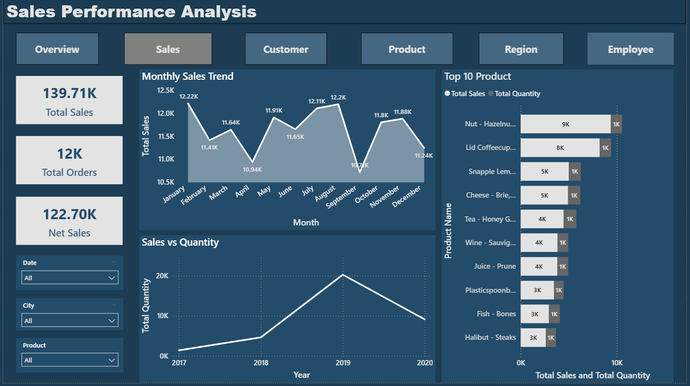
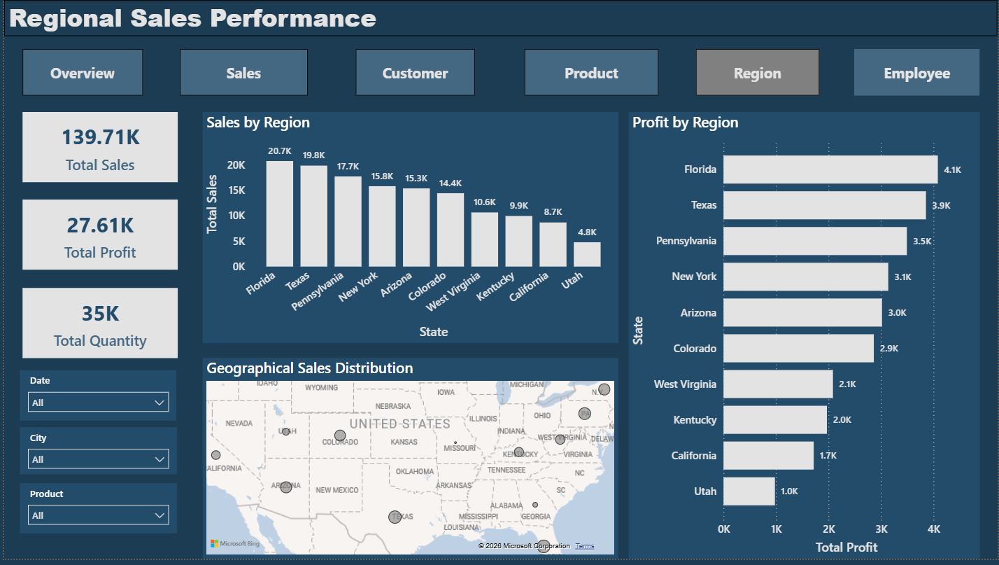
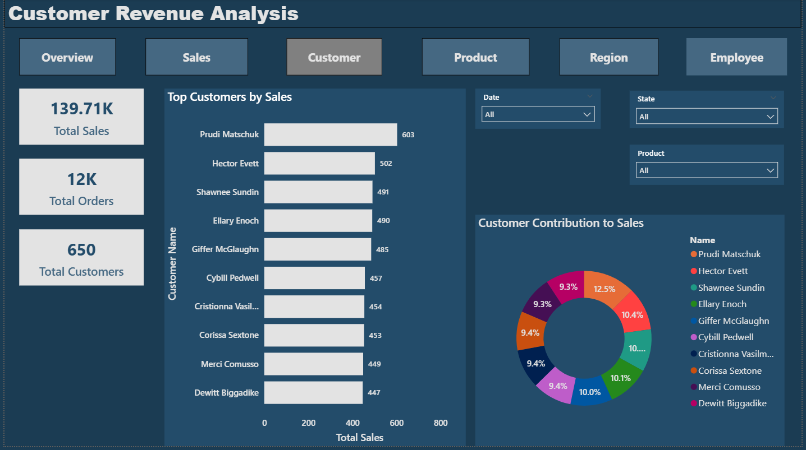
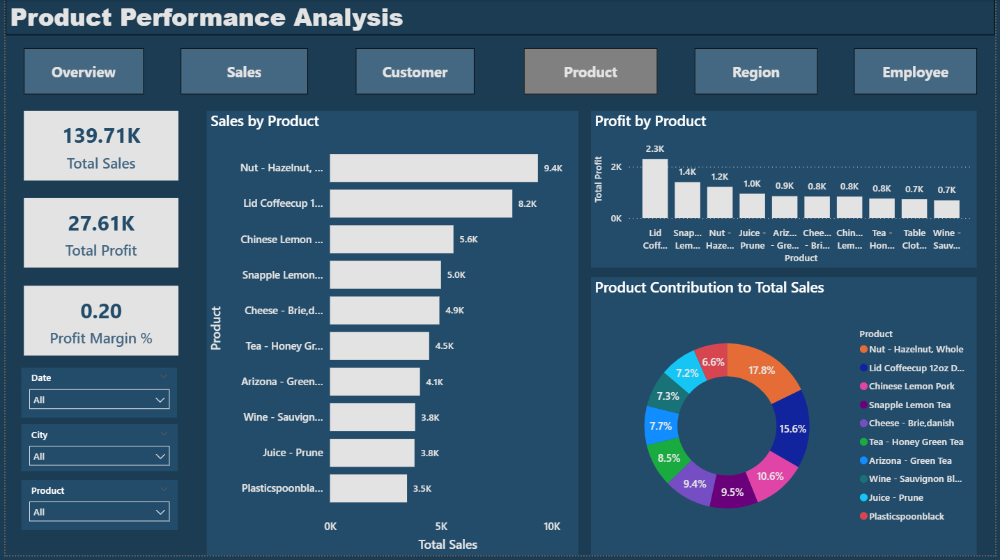
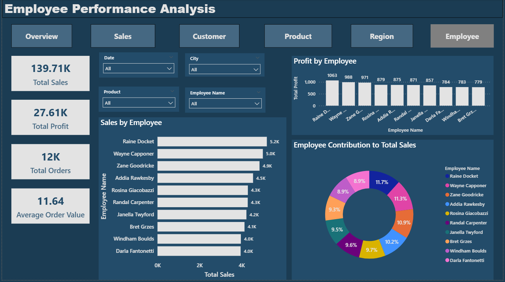

# 📊 Power BI Sales Analytics Dashboard

<p align="center">
  <b>An end-to-end Power BI project that converts raw sales data into interactive, business-ready insights.</b>
  <br/>
  <sub>Designed with real-world KPIs, professional dashboards, and decision-focused analytics.</sub>
</p>

---

## 🚀 Project Overview

This project showcases a **complete Sales Analytics solution** built using **Microsoft Power BI**, following industry best practices in **data modeling, DAX, and dashboard storytelling**.

It enables stakeholders to quickly understand:
- 📈 Overall business performance  
- 🗺️ Regional revenue contribution  
- 👥 Customer value & behavior  
- 📦 Product profitability  
- 👨‍💼 Employee sales performance  

The solution is structured as a **multi-page interactive dashboard**, similar to what is used in real corporate environments.

---

## 🧩 Dashboards Included

### 🟣 Overview Dashboard
- Executive-level KPIs (Total Sales, Net Sales, Profit, Quantity, Customers)
- Sales trend analysis
- Top-performing products
- Quick business health snapshot

### 🟣 Sales Dashboard
- Sales & order trends over time
- Quantity vs revenue analysis
- Date, product, and region filters

### 🟣 Region Dashboard
- Revenue & profit by geography
- Region-wise performance comparison
- Identification of high-performing locations

### 🟣 Customer Dashboard
- Top customers by revenue
- Customer contribution analysis
- Insights into customer value

### 🟣 Product Dashboard
- Best-selling products
- Most profitable products
- Product contribution to total sales

### 🟣 Employee Dashboard
- Sales & profit by employee
- Top-performing employees
- Sales efficiency evaluation

---

## 🧮 Key DAX Measures

This project uses **custom, business-grade DAX measures**, including:

- **Total Sales**
- **Total Profit**
- **Total Tax**
- **Net Sales**
- **Profit Margin %**
- **Total Quantity**
- **Total Customers**
- **Total Orders**

These measures are **dynamic, filter-aware, and relationship-driven**, ensuring accurate insights across all dashboards.

---

## 🛠️ Tech Stack

<p align="center">
  
  
  
  
  
</p>

---

## 🎥 Project Demo Video

▶️ **Complete Dashboard Walkthrough**  
🔗 [Click here to watch the demo video](https://drive.google.com/file/d/14cUsFiDrWWJOtTJ_omaD7DO9To_lR5Us/view)


The video demonstrates:
- Dashboard navigation
- Interactive filters & slicers
- Business insights across all dashboards

---

## 🖼 Dashboard Previews

<table>
  <tr>
    <td align="center">
      <br/>
      <em>Overview Dashboard</em>
    </td>
    <td align="center">
      <br/>
      <em>Sales Dashboard</em>
    </td>
  </tr>

  <tr>
    <td align="center">
      <br/>
      <em>Region Dashboard</em>
    </td>
    <td align="center">
      <br/>
      <em>Customer Dashboard</em>
    </td>
  </tr>

  <tr>
    <td align="center">
      <br/>
      <em>Product Dashboard</em>
    </td>
    <td align="center">
      <br/>
      <em>Employee Dashboard</em>
    </td>
  </tr>
</table>

<sub>📌 Screenshots allow recruiters to quickly understand the project without opening Power BI.</sub>

---

## 📁 Project Structure
```
PowerBI-Sales-Analytics-Dashboard/
│
├── dashboard/
│ └── Sales Performance Analysis Dashboard.pbix
│
├── project_demo/
│ └── Sales Performance Analysis using Power BI.mp4
│
├── screenshots/
│ ├── overview_dashboard.png
│ ├── sales_dashboard.png
│ ├── region_dashboard.png
│ ├── customer_dashboard.png
│ ├── product_dashboard.png
│ └── employee_dashboard.png
│
└── README.md
```

---

## ▶️ How to Use

1. Download the `.pbix` file from the `dashboard/` folder  
2. Open it using **Power BI Desktop**  
3. Navigate dashboards using built-in buttons  
4. Apply slicers (Date, Product, Region, Customer, Employee)  
5. Explore insights dynamically  

---

## 🌟 Key Highlights

- Multi-page, interactive dashboards  
- Business-oriented KPIs & metrics  
- Clean, modern UI design  
- Navigation & global filters  
- Portfolio & interview ready  

---

## 🎯 Business Value

This dashboard empowers decision-makers to:
- Monitor performance efficiently  
- Identify revenue drivers  
- Optimize product & regional strategies  
- Evaluate customer and employee contribution  

---

## 📬 Contact

If you’d like to discuss this project or collaborate, feel free to connect with me on **[LinkedIn](https://www.linkedin.com/in/hiteshparmar18/)**.

---

⭐ **If you find this project useful, consider giving it a star!**
